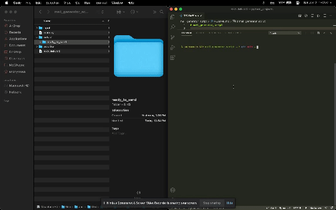

# mail_generator_script

Mail generator script
- Save your letter in the input/letters directory
- Make sure your letter has the [RECIPIENT] and [SENDER]
- In the input/names directory provide your list of recipient names.
- In terminal run python mail_generator_script.py and provide your sender name

